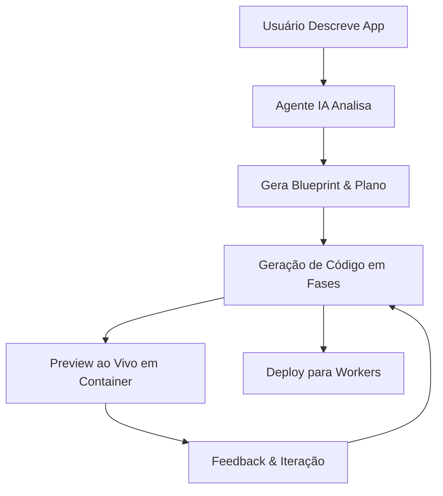

# 🎨 CONCEPT2CODE (C2C)

> **AI-powered full-stack application generator** – Transform concepts into production-ready code with natural language. Built on Cloudflare's edge infrastructure with the Voither Prism Design System.

<div align="center">

## ✨ What is CONCEPT2CODE?

CONCEPT2CODE é uma plataforma de geração de aplicações full-stack com IA, construída em cima da infraestrutura da Cloudflare. Transforme ideias em aplicações funcionais apenas descrevendo o que você quer em linguagem natural.

**Principais Diferenças:**
- 🎨 **Voither Prism Design System** - Sistema de design único combinando Neumorphism, Glassmorphism e Iridescent Metallics
- 🌐 **Multi-LLM** - Suporte para OpenAI, Anthropic Claude e Google Gemini
- 🇧🇷 **Foco em Português** - Interface e prompts otimizados para português brasileiro
- ⚡ **Edge-First** - Totalmente construído na infraestrutura edge da Cloudflare

</div>

---

## 🎨 Voither Prism Design System

CONCEPT2CODE utiliza um sistema de design proprietário que combina três técnicas visuais modernas:

### Filosofia de Design
**"Precisão Cirúrgica em Cor, Etéreo em Forma"**

- **90% Monocromático** - Base em tons de grafite/slate com matizes azulados
- **10% Destaques Cirúrgicos** - Petrol Blue e Moss Green apenas para ações críticas
- **Reflexos Iridescentes** - Transições metalicas blue→teal→green em estados hover
- **Formas Orgânicas** - Cantos altamente arredondados (1.25rem) para UI suave

### Paleta de Cores

**Light Mode:**
- Background: `210 18% 92%` - Blue-gray
- Primary: `210 65% 28%` - Petrol Blue
- Accent: `95 35% 38%` - Moss Green

**Dark Mode:**
- Background: `210 30% 8%` - Near-black com azul
- Primary: `210 70% 45%` - Petrol Blue mais vibrante
- Accent: `95 42% 48%` - Moss Green mais saturado

### Técnicas Visuais

**Neumorphism:**
```css
.neomorph-card     /* Cards elevados com sombras suaves */
.neomorph-button   /* Botões com efeito press */
.neomorph-input    /* Inputs com estilo inset */
```

**Glassmorphism:**
```css
.glass            /* Vidro fosco padrão (blur: 14px) */
.glass-strong     /* Vidro fosco pesado (blur: 18px) */
.glass-light      /* Vidro fosco leve (blur: 10px) */
```

**Iridescent Effects:**
```css
.iridescent-border      /* Bordas com gradiente metálico */
.iridescent-text        /* Texto com gradiente */
.metallic-sheen         /* Reflexo metálico deslizante */
.iridescent-glow-hover  /* Brilho metálico no hover */
```

**📖 [Documentação Completa do Design System](PRISM_DESIGN_SYSTEM.md)**

---

## 🎯 Características Principais

🤖 **Geração de Código com IA** - Desenvolvimento em fases com correção inteligente de erros
⚡ **Previews ao Vivo** - Apps rodando em containers sandboxed
💬 **Chat Interativo** - Guie o desenvolvimento através de conversação natural
📱 **Stack Moderna** - Gera apps React + TypeScript + Tailwind + Prism Design
🚀 **Deploy com Um Clique** - Deploy instantâneo para Workers for Platforms
📦 **Integração GitHub** - Exporte código diretamente para seus repositórios
🎨 **Design System Pronto** - Todos os apps incluem o Voither Prism Design System

---

## 🏗️ Arquitetura Cloudflare

### Stack Completo
- **Frontend**: React 19 + Vite + Tailwind CSS v4 + Voither Prism
- **Backend**: Cloudflare Workers + Durable Objects para agentes de IA
- **Database**: D1 (SQLite) com Drizzle ORM
- **IA**: OpenAI, Anthropic Claude, Google Gemini via AI Gateway
- **Containers**: Sandboxed app previews e execução
- **Storage**: R2 buckets para templates, KV para sessões
- **Deploy**: Workers for Platforms com dispatch namespaces

### Como Funciona



**Processo de Geração:**

1. **Análise com IA** - LLMs processam sua descrição
2. **Criação de Blueprint** - Arquitetura e estrutura de arquivos planejada
3. **Geração em Fases** - Código gerado incrementalmente com gerenciamento de dependências
4. **Garantia de Qualidade** - Linting, type checking e correção automática de erros
5. **Preview ao Vivo** - Execução do app em Cloudflare Containers isolados
6. **Iteração Real-Time** - Interface de chat permite refinamentos contínuos
7. **Deploy com Um Clique** - Apps gerados deployam para Workers for Platforms

---

## 💡 Exemplos de Prompts

**Apps Divertidos:**
> "Crie uma lista de tarefas com drag and drop e modo escuro"

> "Faça um app de desenho com diferentes tamanhos de pincel e cores"

> "Faça um jogo de memória com emojis"

**Apps de Produtividade:**
> "Crie um rastreador de despesas com gráficos e categorias"

> "Faça um timer pomodoro com gerenciamento de tarefas"

> "Crie um rastreador de hábitos com contadores de streak"

**Ferramentas Criativas:**
> "Faça um gerador de paleta de cores a partir de imagens"

> "Crie um editor markdown com preview ao vivo"

> "Faça um gerador de memes com texto sobreposto"

---

## 🚀 Deploy Rápido

### Pré-requisitos
- Cloudflare Workers Paid Plan
- Workers for Platforms subscription
- Advanced Certificate Manager (se usar subdomínio de primeiro nível)

### API Keys Necessárias
- **Google Gemini API Key** - [ai.google.dev](https://ai.google.dev)
- Opcionais: OpenAI API Key, Anthropic API Key

### O Que Configurar

- `GOOGLE_AI_STUDIO_API_KEY` - Chave da API do Google Gemini
- `JWT_SECRET` - String aleatória segura para gerenciamento de sessão
- `WEBHOOK_SECRET` - Segredo de autenticação de webhook
- `SECRETS_ENCRYPTION_KEY` - Chave de criptografia para secrets
- `SANDBOX_INSTANCE_TYPE` - Tier de performance do container (padrão: `standard-3`)
- `ALLOWED_EMAIL` - Email do usuário autorizado a usar o app
- `CUSTOM_DOMAIN` - Domínio customizado configurado na Cloudflare

### Setup de DNS para Domínio Customizado

Adicione este registro DNS na zona que hospeda `CUSTOM_DOMAIN`:

- Type: `CNAME`
- Name: `*.seu-app`
- Target: `seu-app.seu-dominio.com`
- Proxy status: **Proxied** (nuvem laranja)

---

## 🏠 Desenvolvimento Local

### Setup Rápido

```bash
# Clone o repositório
git clone https://github.com/myselfgus/vibe.git
cd vibe

# Instale dependências
bun install

# Execute setup automatizado
bun run setup
```

O script de setup irá guiá-lo através de:
- Configuração de credenciais Cloudflare
- Setup de provedores de IA e OAuth
- Criação de ambientes dev e produção
- Setup e migrações de database
- Deploy de templates

### Servidor de Desenvolvimento

```bash
bun run dev
```

Visite `http://localhost:5173` para acessar C2C localmente.

### Deploy para Produção

```bash
bun run deploy  # Build e deploy automático (inclui migração de DB remoto)
```

---

## 🔐 Segurança & Privacidade

CONCEPT2CODE implementa segurança de nível empresarial:

- 🔐 **Secrets Criptografados** - Todas as API keys armazenadas com criptografia Cloudflare
- 🏰 **Execução Sandboxed** - Apps gerados rodam em containers completamente isolados
- 🛡️ **Validação de Input** - Todos os inputs do usuário sanitizados e validados
- 🚨 **Rate Limiting** - Previne abuso e garante uso justo
- 🔍 **Filtragem de Conteúdo** - Detecção com IA de conteúdo inapropriado
- 📝 **Audit Logs** - Rastreamento completo de todas as atividades de geração
- ✅ **Correção Automática de Contraste WCAG AA/AAA** - Design system garante acessibilidade

---

## 🎨 Usando o Voither Prism Design System

Todos os apps gerados incluem automaticamente o Voither Prism Design System:

### Componentes Prontos

```tsx
// Botão primário com glow iridescente
<Button variant="default">Ação Principal</Button>

// Card com efeito metálico
<Card variant="metallic">
  <CardHeader>
    <CardTitle>Título</CardTitle>
  </CardHeader>
</Card>

// Badge de sucesso (uso cirúrgico de cor)
<Badge variant="success">Confirmado ✓</Badge>

// Input neumórfico
<Input placeholder="Digite texto..." />
```

### Diretrizes de Uso de Cor

**✅ USE Cor Para:**
- CTAs Primários (Login, Submit, Confirmar)
- Status Críticos (Badges de sucesso, alertas de erro)
- Elementos Interativos Ativos (Tabs selecionadas, checkboxes marcadas)
- Badges Importantes (Contadores de notificação)

**❌ EVITE Cor Em:**
- Texto do Corpo (sempre monocromático)
- Backgrounds Grandes (mantenha neutro)
- Bordas Decorativas (use cinza sutil)
- Ícones Secundários (apenas grayscale)
- Navegação Passiva (reserve cor para estado ativo)

---

## 📚 Recursos

### 🛠️ **Plataforma Cloudflare**
- [Workers](https://developers.cloudflare.com/workers/)
- [Durable Objects](https://developers.cloudflare.com/durable-objects/)
- [D1](https://developers.cloudflare.com/d1/)
- [R2](https://developers.cloudflare.com/r2/)
- [AI Gateway](https://developers.cloudflare.com/ai-gateway/)

### 💬 **Comunidade**
- [Discord Cloudflare](https://discord.gg/cloudflaredev)
- [Community Forum](https://community.cloudflare.com/)

### 🎓 **Recursos de Aprendizado**
- [Workers Learning Path](https://developers.cloudflare.com/learning-paths/workers/)
- [Full-Stack Guide](https://developers.cloudflare.com/pages/tutorials/build-a-blog-using-nuxt-and-sanity/)
- [AI Integration](https://developers.cloudflare.com/workers-ai/)

---

## 🔧 Configuração de Containers (Opcional)

### Tipos de Instância Disponíveis

| Tipo | Memória | CPU | Disco | Uso | Disponibilidade |
|------|---------|-----|-------|-----|-----------------|
| `lite` | 256 MiB | 1/16 vCPU | 2 GB | Dev/teste | Todos |
| `standard-1` | 4 GiB | 1/2 vCPU | 8 GB | Apps leves | Todos |
| `standard-2` | 8 GiB | 1 vCPU | 12 GB | Médio | Todos |
| `standard-3` | 12 GiB | 2 vCPU | 16 GB | Produção | Todos (**Padrão**) |
| `standard-4` | 12 GiB | 4 vCPU | 20 GB | Alta performance | Todos |

**Recomendação:** Use `standard-3` (padrão) para melhor balanço ou `standard-4` para máxima performance.

---

## 📄 Licença

MIT License - veja [LICENSE](LICENSE) para detalhes.

---

**Feito com amor usando Claude Code + Cloudflare Workers** 🧡
